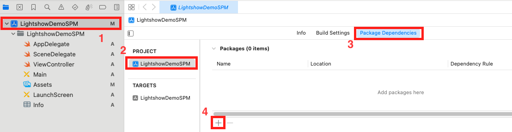
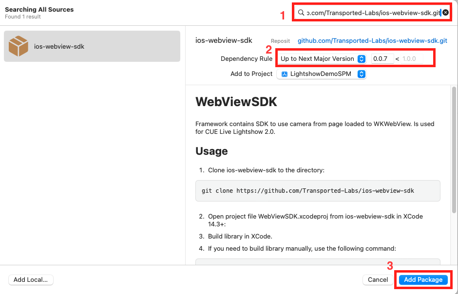
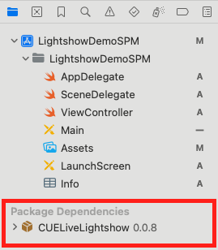
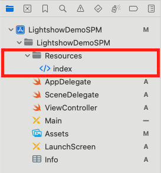
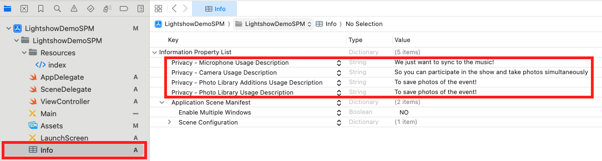

# Lightshow 2 SPM Demo

## Adding the SDK

Add the ios-webview-sdk framework using the Package manager in Xcode. Use the URL: `https://github.com/Transported-Labs/ios-webview-sdk.git`



Once the dialog for the package manager is opened, search for the SPM in the search field at the top right. Enter the following URL to help discover the package: `https://github.com/Transported-Labs/ios-webview-sdk.git`. Set up `Dependency Rule`, if it's needed. Finally press `Add Package` button



You will see the installed package in Project Navigator in the _Package Dependencies_




## Adding sample index.html

Download sample index.html [here](https://htmlpreview.github.io/?https://github.com/Transported-Labs/ios-webview-sdk-demo/blob/main/WebViewDemo/Resources/index.html). Create folder `Resources` and place index.html inside it. Add this folder to the project. Result should be looking like this: 



## Setting up description keys for Camera/Microphone/Photo library access

Please write description texts for the following Info.plist keys:

- NSCameraUsageDescription
- NSMicrophoneUsageDescription
- NSPhotoLibraryAddUsageDescription
- NSPhotoLibraryUsageDescription

Result should be looking like that:



## Calling SDK methods from your code

First add import-directive to your code file
```swift
import WebViewSDK
```

Then add the UIButton object with the following tap handler to open sample index.html file:
```swift
@IBAction func openFileButtonPressed(_ sender: Any) {
    let sdkController = WebViewController()
    sdkController.modalPresentationStyle = .fullScreen
    present(sdkController, animated: true) {
        // Navigate to local testing page
        if let url = Bundle.main.url(forResource: "index", withExtension: "html") {
            sdkController.navigateToFile(url: url)
        }
    }
}
```

Then add one more UIButton object and UITextField for URL-address of the lightshow webpage. The following code for button tap handler will navigate to the given webpage:
```swift
@IBAction func navigateButtonPressed(_ sender: Any) {
    let urlString = self.urlTextField.text ?? ""
    guard urlString != "" else {
        print("Empty URL is not allowed")
        return
    }
    let sdkController = WebViewController()
    if let url = URL(string: urlString) {
        do {
            try sdkController.navigateTo(url: url)
            sdkController.modalPresentationStyle = .fullScreen
            present(sdkController, animated: true)
        } catch InvalidUrlError.runtimeError(let message){
            print("Invalid URL: \(message)")
        } catch {
            print("Error occured: \(error.localizedDescription)")
        }
    }
}
```
